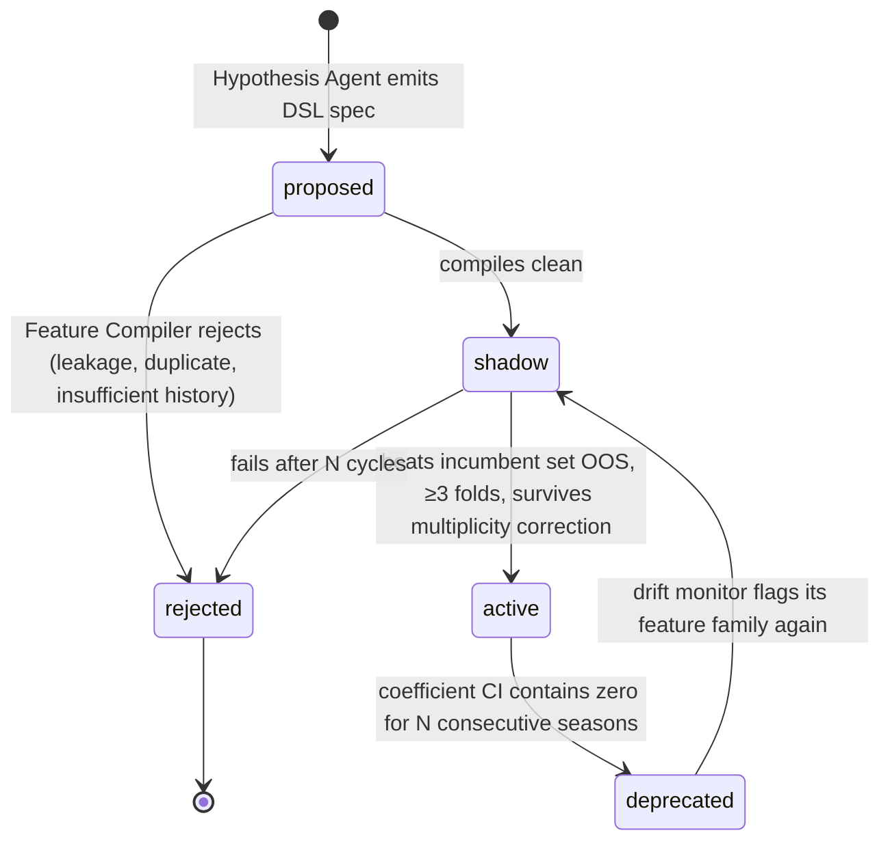

# Phase 1 Addendum — Data Sources and the Dynamic Driver Model

Supersedes the corresponding parts of `sports_gm_phase1_design.md`. Edits to the main
doc are listed at the end.

---

## A. Data source resolution

| Need | Source | Status |
|---|---|---|
| Contract structure (cap hits by year, guarantees, options, cap holds, dead money, trade bonuses) | **Curated ledger in Postgres, version-controlled seed CSV** | No licensed API sells this. Manual seed, ~450 rows, updated on transactions |
| Reconciliation cross-check | Sportradar NBA v8 `player.salary` | Optional. Current base annual salary only. Use as a nightly disagreement alarm, never as a source |
| Cap/tax/apron/exception levels | Config table, hand-entered from the CBA and league announcements | Deterministic constants. Never LLM-parsed |
| Box-score and advanced team/player stats | `nba_api` snapshots | Unlicensed, undocumented endpoints. Ingest-to-snapshot only, never called inside a graph run |
| CBA provision text | Public CBA PDF | Indexed in the vector store for *which rule applies*, never for values |

**Consequence for the rules engine.** Since the ledger is manual, its integrity has to be
enforced in code rather than trusted. Add a `ledger_integrity` check that runs before any
nightly graph execution: team payroll sums reconcile to the summary row, no player appears
on two rosters, every contract has a guarantee status, and no cap hit is stamped `as_of` in
the future. Fail the run rather than produce cap math on a stale ledger.

---

## B. The structural correction: model at team-game level, not team-season

The original design implied fitting drivers against season win%. That gives roughly 30
teams × 10 usable seasons ≈ **300 rows**. Discovering drivers on 300 rows with a
double-digit candidate pool is not analysis, it is overfitting with a backtest attached.

**Revised:** the driver model predicts **team-game outcome and margin** (~2,460 team-games
per season, ~25k rows per decade), and season win% is produced by aggregating game-level
predictions. Same drivers, same DSL, roughly 80× the statistical power. Season-level MAE
remains the *reporting* metric and the baseline comparison from Objective 1; it is no
longer the fitting target.

This also changes `snapshot_player.driver_scores` — driver scores are now computed per
team-game with a trailing window, so the table gains a `team_game` grain:

```
team_game(team_game_id, game_id, team_id, opp_id, game_date, season, is_home,
          margin, won)
team_game_driver(team_game_id, driver_id, value, window_games, as_of)
```

---

## C. Two kinds of dynamism, handled separately

People conflate these, and conflating them is how "adaptive models" end up chasing noise.

**Type 1 — parameter drift.** The same drivers matter, but their weights move. eFG%
carries more of the signal as three-point rate rises; free-throw rate weight shifts when
the league changes foul points of emphasis.

**Type 2 — structural change.** A driver becomes relevant that wasn't previously
meaningful, or an old one dies.

### C1. Parameter drift → time-varying coefficients

Fit a **dynamic linear model**: coefficients follow a random walk, `β_t = β_{t-1} + η`,
estimated with a Kalman filter/smoother (`statsmodels` state-space). The process-noise
variance is the knob that says how fast weights are permitted to move, and it is **fit by
walk-forward CV, not chosen by taste**. Too high and you track noise; too low and you have
a static model with extra machinery.

The non-negotiable test: **the DLM must beat a static ridge on the identical feature set,
out of sample.** If it doesn't, the dynamism is decoration and you keep the static model.
That belongs in the eval harness as a gate, not as a footnote.

Known rule changes get a cheap, legitimate assist: maintain a changepoint calendar
(CBA changes, points of emphasis, the transition take-foul rule) and inflate process noise
at those season boundaries. The model is told where to expect a break instead of having to
discover it from scratch.

### C2. Structural change → driver lifecycle

The driver registry becomes a state machine, which is what makes the system evolve rather
than accumulate:



**Shadow mode is the important part.** A candidate driver is computed and scored every
cycle at zero production weight. It only earns weight by beating the incumbent set out of
sample across at least three walk-forward folds — one good fold is noise. Promotion also
requires a minimum history: `nba_api` hustle stats start in 2015-16 and tracking-derived
aggregates in 2013-14, so a driver built on them has fewer folds available and a
correspondingly higher bar. Encode that as `min_folds_required` on the driver row rather
than remembering it.

**Deprecation matters as much as promotion.** Without it you get a registry that only
grows, and a model that never actually changes its mind about anything.

### C3. Drift detection is the trigger, not the clock

Running driver discovery blindly every night is expensive and mostly finds nothing. Two
monitors fire it instead:

- **Covariate drift** — PSI or a KS test on feature distributions, season over season and rolling-30-game. Catches "the league now shoots differently."
- **Concept drift** — a Page-Hinkley or CUSUM test on out-of-sample residuals. Catches "the same inputs no longer map to the same outcomes," which is the one that actually matters.

When either fires, the alarm payload — which features moved, where residuals concentrate
by team/lineup archetype/game context — becomes the Driver Hypothesis Agent's prompt
context. This is a much better job than "propose some features": it is "here is where the
model is now wrong, and here is what changed in the inputs; go read what people are saying
about it and propose a testable spec."

---

## D. Where the LLM is load-bearing here, precisely

The LLM **never** fits weights, selects the model, or chooses the window. It does two
things a regression cannot:

1. **Translates observation into a testable spec.** Beat writers and analytics writers describe league changes in prose months before it shows up cleanly in aggregate. The agent reads that, and proposes a box-score-computable proxy as a DSL spec. Prose in, falsifiable feature out.
2. **Interprets residual structure.** Given "the model underrates teams with high screen-assist rates since 2023," it generates candidate explanations, each of which becomes a shadow driver.

**Hard guard:** the Hypothesis Agent sees train-fold residuals and literature only. It
never sees a test fold. If it does, every downstream number is contaminated and the whole
harness is theatre. Enforce this server-side in `mcp-warehouse` by clamping the agent's
`as_of` to the fold boundary — a scope the agent cannot widen from its side.

---

## E. Revised evaluation

Baselines, now at game level with season aggregation for reporting:

| Rung | Model | Purpose |
|---|---|---|
| 0 | Prior-season point differential, carried forward | Sanity floor |
| 1 | Static ridge on Four Factors differentials | The published-quality baseline from Objective 1 |
| 2 | Static ridge on the full active driver set | Does driver *discovery* add anything? |
| 3 | DLM on the full active driver set | Does *dynamism* add anything? |

Each rung must beat the one below it out of sample or it does not ship. Rung 3 beating
rung 2 is the only evidence that "dynamic" is real. Targets stay as stated: ≥1.5 wins MAE
improvement over rung 1 on five held-out seasons, ≥0.005 Brier improvement at game level.

Two new trajectory metrics: **shadow-to-active promotion rate** (a rate near 100% means
the bar is too low; near 0% over many cycles means the Hypothesis Agent isn't earning its
cost), and **drift-alarm precision** — share of alarms that led to a promoted driver or a
justified process-noise change.

---

## F. Edits to the main design document

- **§ Data sources** — replace with Section A above.
- **§4 Data model** — add `team_game` and `team_game_driver`; add `min_folds_required`, `status`, and `promoted_at` to `driver`.
- **§5 Evaluation** — replace the baseline paragraph with the four-rung ladder in Section E.
- **§6 Guardrails** — add two rows: *train/test contamination of the Hypothesis Agent* (mitigated by server-side `as_of` clamping) and *stale or inconsistent cap ledger* (mitigated by the pre-run `ledger_integrity` check).
- **§2 Agent roster** — the Driver Hypothesis Agent's inputs become the drift-alarm payload plus train-fold residuals plus retrieved literature, and it is now event-triggered rather than run every cycle.
- **§8 Risks** — risk 1 is upgraded: with game-level data the overfitting risk falls, but the shadow/promotion machinery is now the thing that must not be bypassed under impatience.

**Footnote — production gap.** A shipping team would likely replace the DLM with gradient
boosting refit on a rolling window plus monotonic constraints, accept the loss of
interpretable time-varying coefficients, and get the drift signal from a model-monitoring
platform rather than hand-rolled CUSUM. The DLM is the better choice *here* because you can
plot how a coefficient moved over a decade and see the league change, which is most of the
point.
