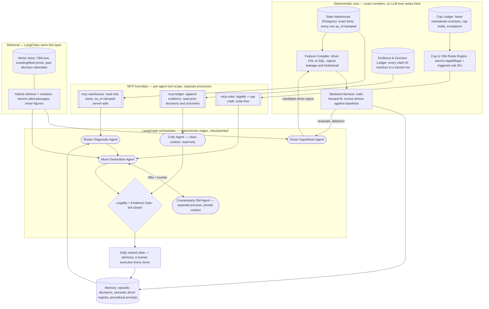

# Sports GM Forecaster v2 — Phase 1 Design

**Scope assumptions** (stated, not confirmed — see questions in chat): NBA, one real
team under management, full salary-cap + 2023-CBA trade rules + roster limits, 3-year
horizon with a win-now/retool toggle, solo dev ~10 hrs/wk, ~$50/mo model spend, local
dev + one small VPS, single user, nightly batch with sub-5s cached ad-hoc reads.
"Production-ready" here = reproducible runs (pinned data snapshot + seed), traced
trajectories, per-run cost ceiling, idempotent retries, and an offline eval gate that
must pass before any prompt or driver change merges.

**Data sources and their problems (flagged before design).** `nba_api` hits
undocumented `stats.nba.com` endpoints — not licensed, rate-limited, can break without
notice. Treat as *ingest-once-to-snapshot*, never as a live call inside a graph run.
Basketball-Reference and Spotrac both prohibit scraping in their ToS; do not build the
cap ledger on them. **Design decision:** contract/cap data is a hand-maintained CSV
ledger under version control, seeded manually. It is small (~450 rows) and it is the
one dataset that must be exact. Public play-by-play via `nba_api` snapshots feeds the
driver model. The CBA text itself is a public PDF and is fine to index.

---

## 1. Component diagram



---

## 2. Agent roster

An agent earns its place only if it meets at least two of: (a) an unbounded number of
steps, (b) a tool scope no other agent may hold, (c) a context that would poison a
neighbour's context, (d) an objective function different from its caller's.

| Agent | Job | In | Out | Why not a function call |
|---|---|---|---|---|
| **Driver Hypothesis** | Propose new candidate performance drivers as DSL specs | Last backtest residuals, driver registry, retrieved analytics literature | 3–5 candidate specs + rationale + citations | Only holder of the literature RAG scope; loops retrieve→propose→dedupe→refine an unknown number of times; its context is thousands of tokens of prose that would wreck the numeric agents |
| **Roster Diagnostic** | Score roster against current driver weights, rank gaps by horizon | `snapshot_id`, weights, horizon mode | Ranked gap list, each with evidence IDs | The *scoring* is a function and stays one. The agent decides which follow-up queries to run (lineup splits, aging curves, injury history) and when marginal queries stop paying — that count is not knowable in advance |
| **Move Generation** | Construct trades/signings that close the top gaps | Gap list, asset inventory, constraint envelope | Candidate moves, each with a `legality_check_id` | Propose→verify→repair loop against the rules engine; typically 4–12 rejections before a legal structure emerges |
| **Counterparty GM** | Decide whether the other team accepts, rejects, or counters | The offer only, plus *its own* private team context | Accept/reject/counter + reason | Genuine A2A: different objective function and deliberately disjoint context. If it shared Move Generation's context it would rubber-stamp every offer, which is exactly the failure the v1 repo has |
| **Critic** | Adversarial review of the ranked slate before release | Slate, evidence rows, prior calibration record | Approve / demote / kill, with reasons | Self-critique inside the generating context is weak; needs a clean context, a different system prompt, and read access to *past miscalibrations* that the generator cannot see |

**Deliberately not agents:** the Rules Engine, Feature Compiler, Backtest Harness, and
graph routing. Routing uses deterministic edges on typed state fields, not an LLM
router — an LLM supervisor here would add cost, latency, and a nondeterminism source
with nothing to decide that a boolean cannot.

---

## 3. State design

| Layer | Holds | Boundary rule |
|---|---|---|
| **LangGraph state** | `run_id`, `snapshot_id`, horizon mode, candidate **IDs**, retry counters, token budget remaining, gate verdicts | Pointers, never payloads. If a value must be exact or must outlive the run, it does not live here. Checkpointed to Postgres so a failed nightly run resumes rather than restarts |
| **Postgres** | Contracts, cap ledger, roster snapshots, driver registry and weights, backtest results, evidence rows, recommendations, realized outcomes | Everything countable, joinable, or auditable. Single source of numeric truth |
| **Vector store** | CBA provision text, scouting and beat-writer prose, past decision rationales — each chunk carrying an FK to its Postgres row | Only unstructured text whose *meaning* is retrieved. A number that appears in retrieved text is treated as decoration; the agent must re-fetch it from `mcp-warehouse` before use |

The v1 repo violates this last rule directly: it retrieves a CBA chunk, asks an LLM to
parse the cap and apron out of it into integers, and then does cap math on those
integers. That is a probabilistic model in the middle of an arithmetic path. In v2 the
retriever may return *which provision applies*; the *values* come from a config table.

---

## 4. Data model (core tables)

```
driver(driver_id, name, spec_dsl, version, proposed_by, status, created_at)
driver_weight(driver_id, model_version, horizon, weight, ci_low, ci_high, fit_window)
roster_snapshot(snapshot_id, team_id, as_of, source_hash, txn_seq)
snapshot_player(snapshot_id, player_id, contract_id, proj_minutes, driver_scores JSONB)
contract(contract_id, player_id, cap_hit_by_year, options, trade_restrictions, source)
evidence(evidence_id, claim_text, source_type, source_ref, value, as_of)
recommendation(rec_id, run_id, snapshot_id, move_json, horizon, rank,
               confidence, legality_check_id, critic_verdict)
outcome(rec_id, realized_at, realized_delta, scored_at)
```

`source_hash` + `as_of` are what make a run reproducible: any backtest or replay pins a
snapshot and cannot see a row stamped later than its decision date.

---

## 5. Evaluation plan

**Baseline (Objective 1).** Two, both honest: (1) prior-season point differential
carried forward, and (2) a ridge regression on the Four Factors differentials. Note that
beating point differential on *same-season* win% is close to impossible — the target is
therefore **forward-looking**: predict next-season win% (and game-level outcomes) using
only information available at the decision date.

**Success criteria.** Beat the Four Factors ridge by ≥1.5 wins MAE on 5 held-out
seasons, and improve game-level Brier score by ≥0.005. The driver-discovery loop's own
contribution is measured by ablation: fixed driver set vs. discovered set, same harness.

**Backtest design.** Walk-forward: fit on seasons ≤ T, evaluate on T+1, roll. Leakage
guards are unit tests, not intentions — the Feature Compiler rejects any spec whose SQL
touches a row with `as_of` > decision date, and a deliberately-leaky spec is a fixture
that must fail.

**Trajectory metrics** (the part most projects skip): tool-call schema validity rate;
retrieval precision@k against ~50 hand-labelled gold spans; **evidence-binding rate** —
share of claims in the final slate whose evidence IDs resolve to real rows; illegal-move
proposal rate before the gate; negotiation rounds to convergence; tokens and dollars per
run; and step-level pass rate on a frozen 40-case golden trajectory set.

**Recommendation quality** is the weakest link and should be labelled as such:
retrodictive eval only — propose moves at a past trade deadline, score against realized
player value. State the confounds; do not present it as validation.

---

## 6. Guardrails, mapped to failure modes

| Failure mode | Guardrail | Where |
|---|---|---|
| LLM does arithmetic (v1's cap parsing) | Agents emit IDs and DSL specs only; a schema validator rejects free-form numerics in any recommendation field | Output parser + gate |
| Illegal move reaches the user | No recommendation is emitted without a **passing** `legality_check_id`; unsupported rules raise, they do not pass | Fail-closed gate |
| Hallucinated players or evidence | Every roster reference must resolve to a `player_id` in the snapshot; unresolvable claims are dropped and logged | Gate + ledger |
| Driver discovery finds noise | Pre-registered holdout, Benjamini-Hochberg across candidates, cap of 5 candidates/cycle, minimum effect size | Backtest harness |
| Cost runaway (v1's retry loop) | Token budget carried in graph state; hard-stop node on breach | LangGraph |
| Prompt injection from ingested prose | Retrieved text is data, never instructions; no tool call may be triggered by retrieved content | Retriever + agent prompts |
| Defamatory claims about real players | Injury/character statements must cite a source row or are dropped | Critic |
| Silent automation | No move is ever executed; the slate is advisory | Product boundary |

---

## 7. Technology justification

| Tech | Role here | Breaks if removed | Concept taught | Production alternative |
|---|---|---|---|---|
| **LangGraph** | Cyclic control flow, checkpointing, resumable nightly runs, budget enforcement | Propose→verify→repair loops and mid-run resume become hand-rolled state machines | Durable agent control flow | A workflow engine (Temporal) + plain SDK calls |
| **LangChain** | ⚠️ **Flagged and redesigned.** Originally "nothing" — LangGraph runs standalone. Now scoped to own the retrieval stack: loaders, splitters, hybrid BM25+dense ensemble retriever, contextual-compression reranker, structured output parsers | Hybrid retrieval and reranking would be rebuilt by hand | Composable retrieval pipelines | Direct pgvector + a reranker API |
| **Vector store + advanced RAG** | CBA provision lookup, scouting prose, and case-based retrieval over past decision rationales | Move Generation cannot cite *which* rule applies; the Critic loses "we saw this situation before" | Hybrid search, metadata filtering, reranking | Same, minus the framework |
| **Persistent memory** | Episodic (decisions + outcomes), semantic (driver registry), procedural (versioned prompts) | Confidence levels cannot be calibrated against realized outcomes, and the daily slate re-proposes moves already rejected | Memory tiering and calibration | Postgres tables + a feature store |
| **MCP** | Process and permission boundary: each agent gets a different tool scope; the Counterparty agent runs out-of-process and can *only* see its own side | Context isolation for the negotiation collapses; scoping becomes a convention instead of an enforced boundary | Tool contracts as a security surface | In-process typed tools + RPC |
| **Multi-agent (A2A)** | Move Generation ↔ Counterparty negotiation; Critic review | Trade realism disappears — you get v1's behaviour, where the proposer also grades itself | Adversarial objectives, context isolation | One model with a rubric, plus a human reviewer |

---

## 8. Top 5 risks

1. **Driver discovery surfaces noise and you believe it.** → Pre-registration, holdout, multiplicity correction, mandatory ablation before any driver enters production weights.
2. **Data source breaks or is not licensable.** → Adapter layer + immutable snapshots; the cap ledger is manual by design; verify ToS before building on any feed.
3. **Scope explosion from six mandatory technologies.** → One vertical slice per module with tests; each slice ends with an "does this still break something if removed?" review.
4. **CBA rules engine complexity (aprons, exceptions, aggregation).** → Implement a documented subset; anything outside it raises `UnsupportedRule` and fails closed rather than guessing.
5. **Eval harness rot / silent leakage.** → `as_of` clamping enforced server-side in the MCP warehouse, plus leakage fixtures that must fail in CI.

---

**Footnotes — where a shipping team would differ.** (a) They would drop LangChain and
LangGraph for a thin state machine over direct SDK calls. (b) The Counterparty agent
would be a learned acceptance model fit on historical trades, not an LLM. (c) MCP would
be internal RPC with an IAM policy. (d) Driver discovery would be a feature store plus
an offline training pipeline, with the LLM confined to explanation. (e) Memory would be
plain Postgres with a nightly calibration job. None of these change the design above —
the whole point is that you are buying understanding, and paying for it in ceremony.
