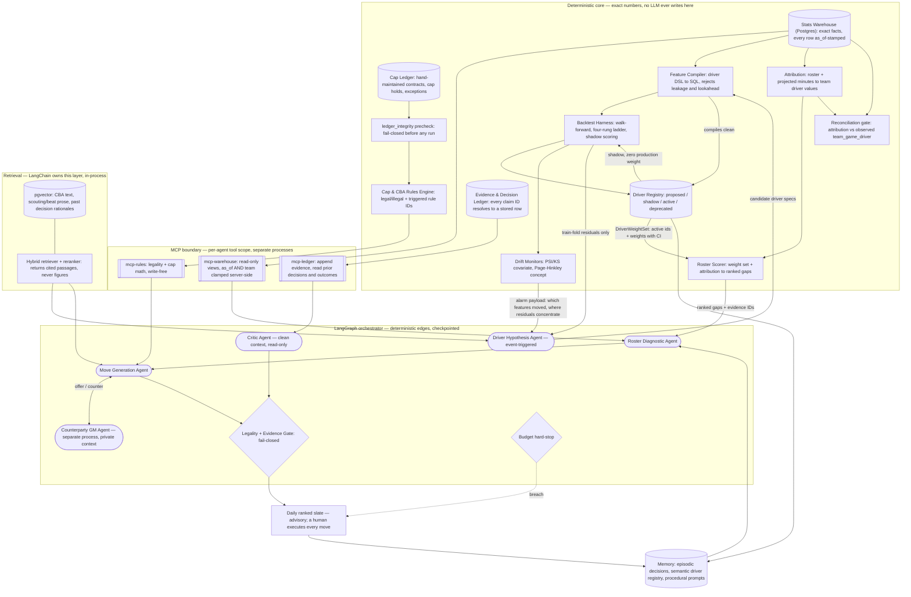
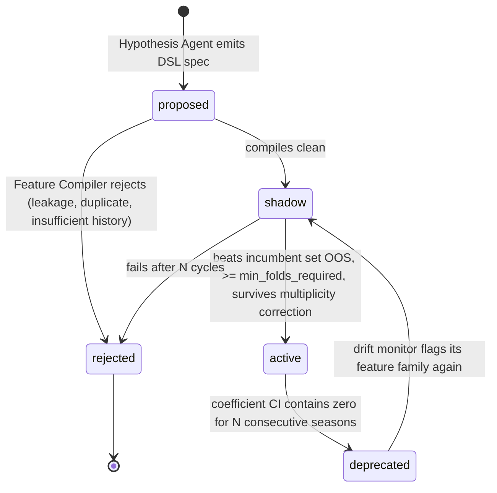

# NBA GM Project — Phase 1 Design (Consolidated, v2.2)

**Version:** 2.2
**Supersedes:** `sports_gm_phase1_design_1.md`, `sports_gm_phase1_addendum.md`, v2.0, v2.1
**Status of those files:** neither source file is retained in this repository. Appendix A
is the surviving record of the design evolution.

**What changed in v2.2.** DECIDE-1 and DECIDE-4 are resolved and folded into design text.
Retrodictive eval seeds historical ledgers at three trade deadlines. The rules subset is
enumerated and closed. Draft picks are tradeable, which adds the Stepien rule, pick
protections, and two tables. Trade exceptions and the bi-annual exception are cut to pay
for picks. DECIDE-2, DECIDE-3, and DECIDE-5 remain open. Full log in Appendix A.

**What changed in v2.1.** The driver model and roster evaluation are separated into three
systems rather than two, with an **attribution layer** named explicitly between them (new
§7). Attribution was previously implicit inside the Roster Diagnostic agent — the least
validated step in the pipeline, sitting unmeasured immediately downstream of the most
rigorously measured one. v2.1 gives it a package, a versioned contract, a reconciliation
gate, and a guardrail row. Roster scoring moves out of the agent into deterministic core,
which is what §3 always said it was. Sections 7–13 are renumbered from v2.0's 6–12.

**What v2.0 consolidated.** All six edits listed in the addendum's §F, applied inline,
plus a redrawn component diagram, the `legality_check` table, the pgvector decision, and
four open decisions stated as build blockers (§12). Full change log in Appendix A.

**Reading rule.** This document is the sole source of truth for Phase 1. Items marked
**DECIDE** are unresolved and must be answered before the affected module is built; they
are not defaults.

---

**Scope assumptions** (stated, not confirmed): NBA, one real team under management, full
salary-cap + 2023-CBA trade rules + roster limits, 3-year horizon with a
win-now/retool toggle, solo dev ~10 hrs/wk, ~$50/mo model spend, local dev + one small
VPS, single user, nightly batch with sub-5s cached ad-hoc reads.

"Production-ready" here = reproducible runs (pinned data snapshot + seed), traced
trajectories, per-run cost ceiling, idempotent retries, and an offline eval gate that
must pass before any prompt or driver change merges.

---

## 1. Data sources and licensing

| Need | Source | Status |
| --- | --- | --- |
| Contract structure (cap hits by year, guarantees, options, cap holds, dead money, trade bonuses) | **Curated ledger in Postgres, version-controlled seed CSV** | No licensed API sells this. Manual seed, ~450 rows per ledger version, updated on transactions |
| Historical contract structure at past decision dates | **Additional hand-seeded ledger versions**, one per retrodictive deadline (§9.4) | Three versions: 2023-02-09, 2024-02-08, 2025-02-06. Each is a full ~450-row snapshot, not a diff |
| Draft pick ownership and protections | **Hand-seeded, first round only, seven-year window** | Protections are prose in press releases, not table values. Encoded as typed structures at seed time, never parsed at runtime |
| Reconciliation cross-check | Sportradar NBA v8 `player.salary` | Optional. Current base annual salary only. Use as a nightly disagreement alarm, never as a source |
| Cap / tax / apron / exception levels | Config table, hand-entered from the CBA and league announcements | Deterministic constants. Never LLM-parsed |
| Box-score and advanced team/player stats | `nba_api` snapshots | Unlicensed, undocumented endpoints. Ingest-to-snapshot only, never called inside a graph run |
| CBA provision text | Public CBA PDF | Indexed in the vector store for *which rule applies*, never for values |

Basketball-Reference and Spotrac both prohibit scraping in their ToS. The cap ledger is
not built on them, and no HTML-scraping dependency belongs in this project.

**Consequence for the rules engine.** Since the ledger is manual, its integrity has to be
enforced in code rather than trusted. A `ledger_integrity` check runs before any nightly
graph execution: team payroll sums reconcile to the summary row, no player appears on two
rosters, every contract has a guarantee status, and no cap hit is stamped `as_of` in the
future. Fail the run rather than produce cap math on a stale ledger.

---

## 2. Component diagram



Changes from the v1 diagram: the drift monitors and the alarm payload are the Hypothesis
Agent's trigger and primary input; the driver registry is a first-class store with a
shadow path back into the backtest harness; the ledger integrity precheck sits between the
cap ledger and the rules engine; the budget hard-stop node is drawn.

Added in v2.1: attribution and roster scoring are drawn inside the deterministic core,
with the reconciliation gate between attribution and the observed warehouse facts. The
Roster Diagnostic agent consumes ranked gaps rather than computing them. `REG` reaches the
scorer as a `DriverWeightSet` (§7.3), not as loose weights.

---

## 3. Agent roster

An agent earns its place only if it meets at least two of: (a) an unbounded number of
steps, (b) a tool scope no other agent may hold, (c) a context that would poison a
neighbour's context, (d) an objective function different from its caller's.

| Agent | Job | In | Out | Why not a function call |
| --- | --- | --- | --- | --- |
| **Driver Hypothesis** *(event-triggered)* | Propose new candidate performance drivers as DSL specs | Drift-alarm payload, **train-fold** residuals, driver registry, retrieved analytics literature | 3–5 candidate specs + rationale + citations | Only holder of the literature RAG scope; loops retrieve→propose→dedupe→refine an unknown number of times; its context is thousands of tokens of prose that would wreck the numeric agents |
| **Roster Diagnostic** | Investigate and contextualise the ranked gaps produced by `core/roster` | `snapshot_id`, `model_version`, ranked gaps from the deterministic scorer, horizon mode | Annotated gap list with evidence IDs and follow-up findings | The *scoring* is a function and lives in `core/roster/scorer.py` (§7.6). The agent decides which follow-up queries to run (lineup splits, aging curves, injury history) and when marginal queries stop paying — that count is not knowable in advance |
| **Move Generation** | Construct trades/signings that close the top gaps | Gap list, asset inventory, constraint envelope | Candidate moves, each with a `legality_check_id` | Propose→verify→repair loop against the rules engine; typically 4–12 rejections before a legal structure emerges |
| **Counterparty GM** | Decide whether the other team accepts, rejects, or counters | The offer only, plus *its own* private team context (see **DECIDE-2**) | Accept/reject/counter + reason | Genuine A2A: different objective function and deliberately disjoint context. If it shared Move Generation's context it would rubber-stamp every offer, which is exactly the failure the v1 repo has |
| **Critic** | Adversarial review of the ranked slate before release | Slate, evidence rows, prior calibration record | Approve / demote / kill, with reasons | Self-critique inside the generating context is weak; needs a clean context, a different system prompt, and read access to *past miscalibrations* that the generator cannot see |

**On the Hypothesis Agent's trigger.** It no longer runs every cycle. Running driver
discovery blindly every night is expensive and mostly finds nothing. It fires when a
drift monitor does (§6.3), and the alarm payload becomes its prompt context. That turns
the job from "propose some features" into "here is where the model is now wrong, and
here is what changed in the inputs; propose a testable spec."

**Deliberately not agents:** the Rules Engine, Feature Compiler, Backtest Harness, drift
monitors, attribution, roster scoring, and graph routing. Routing uses deterministic edges on typed state fields, not
an LLM router — an LLM supervisor here would add cost, latency, and a nondeterminism
source with nothing to decide that a boolean cannot.

---

## 4. State design

| Layer | Holds | Boundary rule |
| --- | --- | --- |
| **LangGraph state** | `run_id`, `snapshot_id`, `model_version`, horizon mode, candidate **IDs**, retry counters, token budget remaining, gate verdicts | Pointers, never payloads. If a value must be exact or must outlive the run, it does not live here. Checkpointed to Postgres so a failed nightly run resumes rather than restarts |
| **Postgres** | Contracts, cap ledger, roster snapshots, team-game facts, driver registry and weights, backtest results, evidence rows, legality checks, recommendations, realized outcomes | Everything countable, joinable, or auditable. Single source of numeric truth |
| **Vector store (pgvector, same Postgres instance)** | CBA provision text, scouting and beat-writer prose, past decision rationales — each chunk carrying an FK to its Postgres row | Only unstructured text whose *meaning* is retrieved. A number that appears in retrieved text is treated as decoration; the agent must re-fetch it from `mcp-warehouse` before use |

The v1 repo violates this last rule directly: it retrieves a CBA chunk, asks an LLM to
parse the cap and apron out of it into integers, then does cap math on those integers.
That is a probabilistic model in the middle of an arithmetic path. Here the retriever may
return *which provision applies*; the *values* come from a config table.

**Cap arithmetic uses `Decimal`, never `float`.** Apron thresholds are cliff functions; a
1e-9 rounding error flips a legality boolean and silently corrupts a backtest.

---

## 5. Data model

Core tables. Grain is team-game for driver values (see §6), not team-season.

```
driver(driver_id, name, spec_dsl, version, proposed_by, status,
       min_folds_required, promoted_at, created_at)

driver_weight(driver_id, model_version, horizon, weight, ci_low, ci_high, fit_window)

team_game(team_game_id, game_id, team_id, opp_id, game_date, season, is_home,
          margin, won)

team_game_driver(team_game_id, driver_id, value, window_games, as_of)

ledger_version(ledger_version_id, label, as_of, is_current, seeded_at)

roster_snapshot(snapshot_id, team_id, as_of, ledger_version_id, source_hash, txn_seq)

draft_pick(pick_id, original_team_id, current_owner_team_id, draft_year, round,
           ledger_version_id, is_swap_right, notes)

pick_protection(protection_id, pick_id, protection_type, range_low, range_high,
                rolls_to_year, converts_to_second, sequence)

snapshot_player(snapshot_id, player_id, contract_id, proj_minutes)

player_game_driver(game_id, player_id, driver_id, value, window_games, as_of)

projected_team_driver(snapshot_id, driver_id, attribution_version,
                      projected_value, ci_low, ci_high, as_of)

roster_gap(gap_id, snapshot_id, model_version, attribution_version, driver_id,
           horizon, gap_size, ci_low, ci_high, rank, evidence_ids)

contract(contract_id, player_id, ledger_version_id, options, trade_restrictions,
         guarantee_status, source)

contract_year(contract_id, season, cap_hit, guaranteed, option_type)

evidence(evidence_id, claim_text, source_type, source_ref, value, as_of)

legality_check(legality_check_id, snapshot_id, move_hash, verdict,
               triggered_rule_ids, engine_version, checked_at)

recommendation(rec_id, run_id, snapshot_id, model_version, attribution_version,
               move_json, horizon, rank, confidence, legality_check_id,
               critic_verdict)

outcome(rec_id, realized_at, realized_delta, scored_at)
```

`driver.status` is one of `proposed | shadow | active | deprecated | rejected` (§6.2).

`snapshot_player` no longer carries `driver_scores`; driver values moved to
`team_game_driver` when the grain changed.

`source_hash` + `as_of` are what make a run reproducible: any backtest or replay pins a
snapshot and cannot see a row stamped later than its decision date.

`legality_check` is a new table — v1's design referenced `legality_check_id` from
`recommendation` without defining what it pointed at. `engine_version` matters because a
verdict is only meaningful relative to the rule subset that was implemented when it ran.

`player_game_driver`, `projected_team_driver`, and `roster_gap` are new in v2.1 and are
the attribution layer's inputs and outputs (§7). `projected_team_driver` is what the
reconciliation gate (§7.4) compares against observed `team_game_driver`.

`ledger_version` is new in v2.2 and is what lets historical seeds coexist with the
current ledger. Every cap-bearing row carries a `ledger_version_id`; the rules engine
resolves against exactly one version per run and never mixes them. `contract.cap_hit_by_year`
is normalised into `contract_year` — a JSON blob of year-to-dollar mappings cannot be
joined, aggregated, or constrained, and payroll reconciliation in `ledger_integrity` needs
all three.

`draft_pick` and `pick_protection` are new in v2.2. Protections are a typed, ordered
structure rather than free text, because "top-4 protected in 2026, rolling to top-2 in
2027, else two seconds" is conditional logic and the Stepien check has to evaluate it.

`recommendation` now pins `model_version` and `attribution_version` alongside
`snapshot_id`. Under a DLM the weights move by construction, so a gap ranking is
reproducible only if the weight set that produced it is identified. Intervals propagate:
`roster_gap` carries `ci_low`/`ci_high` rather than a point estimate, so the Critic has
something to demote on.

---

## 6. The driver model

### 6.0 The structural correction: team-game, not team-season

The original design implied fitting drivers against season win%. That gives roughly 30
teams × 10 usable seasons ≈ **300 rows**. Discovering drivers on 300 rows with a
double-digit candidate pool is not analysis, it is overfitting with a backtest attached.

The driver model predicts **team-game outcome and margin** (~2,460 team-games per season,
~25k rows per decade), and season win% is produced by aggregating game-level predictions.
Same drivers, same DSL, roughly 80× the statistical power. Season-level MAE remains the
*reporting* metric and the baseline comparison; it is no longer the fitting target.

### 6.1 Two kinds of dynamism, handled separately

Conflating these is how "adaptive models" end up chasing noise.

**Type 1 — parameter drift.** The same drivers matter, but their weights move. eFG%
carries more of the signal as three-point rate rises; free-throw rate weight shifts when
the league changes foul points of emphasis.

**Type 2 — structural change.** A driver becomes relevant that wasn't previously
meaningful, or an old one dies.

**Type 1 → time-varying coefficients.** Fit a dynamic linear model where coefficients
follow a random walk, `β_t = β_{t-1} + η`, estimated with a Kalman filter/smoother
(`statsmodels` state-space). The process-noise variance is the knob that says how fast
weights are permitted to move, and it is **fit by walk-forward CV, not chosen by taste**.
Too high and you track noise; too low and you have a static model with extra machinery.

The non-negotiable test: **the DLM must beat a static ridge on the identical feature set,
out of sample.** If it doesn't, the dynamism is decoration and you keep the static model.
That is a gate in the eval harness, not a footnote.

Known rule changes get a cheap, legitimate assist: maintain a changepoint calendar (CBA
changes, points of emphasis, the transition take-foul rule) and inflate process noise at
those season boundaries. The model is told where to expect a break instead of having to
discover it from scratch.

### 6.2 Type 2 → driver lifecycle

The driver registry is a state machine, which is what makes the system evolve rather than
accumulate:



**Shadow mode is the important part.** A candidate driver is computed and scored every
cycle at zero production weight. It only earns weight by beating the incumbent set out of
sample across at least `min_folds_required` walk-forward folds — one good fold is noise.
Promotion also requires a minimum history: `nba_api` hustle stats start in 2015-16 and
tracking-derived aggregates in 2013-14, so a driver built on them has fewer folds
available and a correspondingly higher bar. That is encoded on the driver row rather than
remembered. (Fold granularity is unresolved — see **DECIDE-3**.)

**Deprecation matters as much as promotion.** Without it you get a registry that only
grows, and a model that never actually changes its mind about anything. Deprecation also
propagates: `active_driver_ids` in the weight set (§7.3) is what stops roster evaluation
scoring against a driver the model has abandoned.

**Every DSL spec declares its grain** (`team_game` or `player_game`). The Feature Compiler
rejects a spec whose declared grain does not match the columns it touches. Without the
declaration a mis-grained spec compiles and produces plausible numbers, which is worse
than failing.

### 6.3 Drift detection is the trigger, not the clock

Two monitors fire discovery:

- **Covariate drift** — PSI or a KS test on feature distributions, season over season and rolling-30-game. Catches "the league now shoots differently."
- **Concept drift** — a Page-Hinkley or CUSUM test on out-of-sample residuals. Catches "the same inputs no longer map to the same outcomes," which is the one that actually matters.

The alarm payload — which features moved, where residuals concentrate by team, lineup
archetype, and game context — becomes the Hypothesis Agent's prompt context.

---

## 7. System decomposition: driver model, attribution, roster evaluation

### 7.1 The grain mismatch

The driver model is fit at **team-game** grain. Its coefficients answer "how much does a
unit of team eFG% differential move margin." Roster evaluation needs **player** grain:
"what does this player contribute, and where is the gap."

Nothing in v2.0 bridged those. A coefficient on a team-level driver does not decompose
into player contributions for free. Something must take a roster plus projected minutes
and produce projected *team* driver values, and that something is a model with its own
assumptions about minutes allocation, on/off effects, lineup interaction, and aging.

In v2.0 that inference was implicit inside the Roster Diagnostic agent. That is the exact
pattern this design exists to prevent: the hardest and least-validated modelling step
sitting inside a component nobody measures, immediately downstream of a component that is
rigorously measured. The four-rung ladder gives the driver model real credibility; if
attribution is invisible, that credibility silently transfers to numbers the ladder never
touched.

There are three systems, not two.

| System | Grain | Owns | Validated by |
| --- | --- | --- | --- |
| **Driver model** | team-game | Which drivers matter and how much, over time | Four-rung ladder, wins MAE, Brier — falsifiable |
| **Attribution** | player + minutes → team driver values | Turning a roster into projected team-level driver values | Reconciliation gate (§7.4) |
| **Roster evaluation** | player, ranked gaps | Scoring a roster against a weight set, ranking gaps by horizon | Retrodictive only — weak, and §9.4 says so |

### 7.2 Why they are decoupled

The strongest reason is not reuse or testability, though both follow. It is that the three
have **different epistemic status**, and a hard boundary is what keeps that visible. Rung 3
beating rung 2 is real evidence about the driver model. It is not evidence that the gap
rankings are any good. Coupled code lets that distinction erode quietly; a versioned
interface makes it structural.

The practical payoff at 10 hrs/wk is real too: roster evaluation can be built and tested
against a frozen synthetic weight set long before the DLM converges, and the driver model
never needs to know a roster exists.

**Dependency direction is one-way.** Roster evaluation reads a weight set. The driver
model has no knowledge of rosters, gaps, or recommendations.

### 7.3 The contract

```python
@dataclass(frozen=True)
class DriverWeightSet:
    model_version: str
    horizon: Horizon
    fit_window: DateRange
    weights: Mapping[DriverId, WeightWithCI]   # interval, not point estimate
    active_driver_ids: frozenset[DriverId]
```

Two properties that are easy to drop and expensive to lose:

**Confidence intervals, not point estimates.** `driver_weight` already stores `ci_low` and
`ci_high`. If roster evaluation consumes point estimates, gap rankings inherit false
precision and the Critic has nothing to demote on. The interval propagates.

**`model_version` is pinned into `recommendation`,** with the same discipline as
`snapshot_id`. A gap ranking is reproducible only if you can say which weights produced
it, and under a DLM the weights move by construction.

### 7.4 The reconciliation gate

Independent systems can quietly describe different worlds. The check that makes them
interoperable rather than merely separate:

> For a historical team-game, attribution-aggregated driver values — computed from that
> game's actual roster and realized minutes — must reconcile to the observed
> `team_game_driver` row within tolerance.

If they do not reconcile, the driver model was fit on one representation of a team while
roster evaluation scores a different one, and every gap ranking is built on sand. Both
sides are already in Postgres, so this is cheap. It is a hard gate in
`tests/integration/`, not a diagnostic.

### 7.5 What stays shared

Over-decoupling has its own costs. Three things are genuinely common and duplicating them
creates drift:

- **The driver registry** is shared vocabulary. Both sides key off `driver_id`, and when a driver moves to `deprecated` roster evaluation must stop using it in the same cycle — that is `active_driver_ids` doing its job.
- **The DSL and Feature Compiler** are shared, but each spec now carries a **grain declaration** (`team_game` or `player_game`). Without it a spec compiles at the wrong grain and fails silently rather than loudly.
- **The leakage guard** stays single. Two implementations of `as_of` clamping is two chances to get it wrong.

### 7.6 Consequence for the codebase

Roster scoring is deterministic code in `core/roster/`, not agent behaviour. §3 already
says the scoring is a function and stays one; v2.0's module layout left it implicit inside
`agents/roster_diagnostic.py`, which contradicted that. Attribution gets its own package.

```
core/
├── models/            # driver model: team-game → outcome
├── attribution/       # the system that was hiding
│   ├── minutes.py
│   ├── player_driver.py
│   └── aggregate.py   # player-level → projected team driver values
└── roster/            # extracted from the agent
    ├── scorer.py
    ├── gaps.py
    └── replacement.py
```

---

## 8. Where the LLM is load-bearing, precisely

The LLM **never** fits weights, selects the model, or chooses the window. It does two
things a regression cannot:

1. **Translates observation into a testable spec.** Beat writers and analytics writers describe league changes in prose months before it shows up cleanly in aggregate. The agent reads that and proposes a box-score-computable proxy as a DSL spec. Prose in, falsifiable feature out.
2. **Interprets residual structure.** Given "the model underrates teams with high screen-assist rates since 2023," it generates candidate explanations, each of which becomes a shadow driver.

**Hard guard:** the Hypothesis Agent sees train-fold residuals and literature only. It
never sees a test fold. If it does, every downstream number is contaminated and the whole
harness is theatre. This is enforced server-side in `mcp-warehouse` by clamping the
agent's `as_of` to the fold boundary — a scope the agent cannot widen from its side.

---

## 9. Evaluation plan

### 9.1 The baseline ladder

Fitting at game level; season aggregation for reporting.

| Rung | Model | Purpose |
| --- | --- | --- |
| 0 | Prior-season point differential, carried forward | Sanity floor |
| 1 | Static ridge on Four Factors differentials | The published-quality baseline from Objective 1 |
| 2 | Static ridge on the full active driver set | Does driver *discovery* add anything? |
| 3 | DLM on the full active driver set | Does *dynamism* add anything? |

Each rung must beat the one below it out of sample or it does not ship. Rung 3 beating
rung 2 is the only evidence that "dynamic" is real.

**Success criteria.** Beat rung 1 by ≥1.5 wins MAE on 5 held-out seasons, and improve
game-level Brier score by ≥0.005. The discovery loop's own contribution is measured by
ablation: fixed driver set vs. discovered set, same harness.

Note that beating point differential on *same-season* win% is close to impossible — the
target is therefore forward-looking: predict next-season win% and game-level outcomes
using only information available at the decision date.

### 9.2 Backtest design

Walk-forward: fit on seasons ≤ T, evaluate on T+1, roll. Leakage guards are unit tests,
not intentions — the Feature Compiler rejects any spec whose SQL touches a row with
`as_of` > decision date, and a deliberately-leaky spec is a fixture that **must fail** in
CI.

The **attribution reconciliation gate** (§7.4) runs in the same CI job and is equally
hard: attribution-aggregated driver values for a historical team-game must match the
observed `team_game_driver` row within tolerance. It is not a diagnostic and it does not
warn; it fails the build.

### 9.3 Trajectory metrics

The part most projects skip: tool-call schema validity rate; retrieval precision@k
against ~50 hand-labelled gold spans; **evidence-binding rate** — share of claims in the
final slate whose evidence IDs resolve to real rows; illegal-move proposal rate before
the gate; negotiation rounds to convergence; tokens and dollars per run; step-level pass
rate on a frozen 40-case golden trajectory set; **shadow-to-active promotion rate** (near
100% means the bar is too low, near 0% over many cycles means the Hypothesis Agent isn't
earning its cost); and **drift-alarm precision** — share of alarms that led to a promoted
driver or a justified process-noise change. Also **attribution reconciliation error** —
the residual between projected and observed team driver values, tracked over time rather
than only checked at the CI threshold, since slow drift here is invisible to a pass/fail
gate.

### 9.4 Recommendation quality

The weakest link, and it should be labelled as such: retrodictive eval only — propose
moves at a past trade deadline, score against realized player value. State the confounds;
do not present it as validation.

**Do not let the ladder's credibility leak into this number.** Rung 3 beating rung 2 is
evidence about the driver model. It is not evidence that the gap rankings or the
recommendations are good. The three systems in §7 have deliberately different evidentiary
standing, and reports should say so.

**Resolved in v2.2.** Retrodictive eval requires a cap ledger *as of the historical
decision date*, because Move Generation cannot emit a recommendation without a passing
`legality_check_id`. Three historical ledger versions are hand-seeded, at the
2023-02-09, 2024-02-08, and 2025-02-06 trade deadlines. Each is a complete ~450-row
snapshot plus first-round pick ownership, not a diff against the current ledger.

Three is the floor. Two deadlines cannot distinguish a working system from a lucky one,
and the seeding cost is roughly linear, so a fourth can be added later without rework.
The dominant cost is not the contract rows; it is reconstructing pick protections, which
exist as prose in press releases. Budget for that specifically.

---

## 10. Guardrails, mapped to failure modes

| Failure mode | Guardrail | Where |
| --- | --- | --- |
| LLM does arithmetic (v1's cap parsing) | Agents emit IDs and DSL specs only; a schema validator rejects free-form numerics in any recommendation field | Output parser + gate |
| Illegal move reaches the user | No recommendation is emitted without a **passing** `legality_check_id`; unsupported rules raise, they do not pass | Fail-closed gate |
| Hallucinated players or evidence | Every roster reference must resolve to a `player_id` in the snapshot; unresolvable claims are dropped and logged | Gate + ledger |
| Driver discovery finds noise | Pre-registered holdout, Benjamini-Hochberg across candidates, cap of 5 candidates/cycle, minimum effect size, shadow mode before any production weight | Backtest harness + registry |
| Cost runaway (v1's retry loop) | Token budget carried in graph state; hard-stop node on breach | LangGraph |
| Prompt injection from ingested prose | Retrieved text is data, never instructions; no tool call may be triggered by retrieved content | Retriever + agent prompts |
| Defamatory claims about real players | Injury/character statements must cite a source row or are dropped | Critic |
| Silent automation | No move is ever executed; the slate is advisory | Product boundary |
| **Train/test contamination of the Hypothesis Agent** | `as_of` clamped to the fold boundary server-side, in a scope the agent cannot widen | `mcp-warehouse` |
| **Stale or inconsistent cap ledger** | `ledger_integrity` precheck; fail the run rather than compute on a bad ledger | Pre-run gate |
| **Unvalidated attribution inherits the ladder's credibility** | Attribution is a named, versioned system with its own reconciliation gate; `attribution_version` is pinned into every gap and recommendation | `core/attribution` + CI |
| **Mis-grained driver spec produces plausible wrong numbers** | Every DSL spec declares `team_game` or `player_game`; the Feature Compiler rejects a mismatch | Feature Compiler |

---

## 11. Technology justification

| Tech | Role here | Breaks if removed | Concept taught | Production alternative |
| --- | --- | --- | --- | --- |
| **LangGraph** | Cyclic control flow, checkpointing to Postgres, resumable nightly runs, budget enforcement | Propose→verify→repair loops and mid-run resume become hand-rolled state machines | Durable agent control flow | A workflow engine (Temporal) + plain SDK calls |
| **LangChain** | Scoped to own the retrieval stack only: loaders, splitters, hybrid BM25+dense ensemble retriever, contextual-compression reranker, structured output parsers. It does not orchestrate | Hybrid retrieval and reranking would be rebuilt by hand | Composable retrieval pipelines | Direct pgvector + a reranker API |
| **Vector store + advanced RAG** | CBA provision lookup, scouting prose, case-based retrieval over past decision rationales. **Implemented on pgvector in the same Postgres instance** — a second datastore earns nothing on a single small VPS | Move Generation cannot cite *which* rule applies; the Critic loses "we saw this situation before" | Hybrid search, metadata filtering, reranking | Same, minus the framework |
| **Persistent memory** | Episodic (decisions + outcomes), semantic (driver registry), procedural (versioned prompts) | Confidence cannot be calibrated against realized outcomes, and the daily slate re-proposes moves already rejected | Memory tiering and calibration | Postgres tables + a feature store |
| **MCP** | Process and permission boundary: each agent gets a different tool scope; the Counterparty agent runs out-of-process and can *only* see its own side. Clamps are server-side on both `as_of` and `team_id` | Context isolation for the negotiation collapses; scoping becomes a convention instead of an enforced boundary | Tool contracts as a security surface | In-process typed tools + RPC |
| **Multi-agent (A2A)** | Move Generation ↔ Counterparty negotiation; Critic review | Trade realism disappears — you get v1's behaviour, where the proposer also grades itself | Adversarial objectives, context isolation | One model with a rubric, plus a human reviewer |

---

## 12. Decisions

Resolved decisions are kept here rather than dissolved into the text, so the reasoning and
the cost accepted stay visible. Items still marked **DECIDE** block code and are not
answered by default.

### RESOLVED-1 — Retrodictive eval and the historical cap ledger

**Decision:** hand-seed three historical ledger versions, at the 2023, 2024, and 2025
February trade deadlines. See §9.4. The `ledger_version` table (§5) is what makes
historical and current ledgers coexist without the rules engine ever mixing them.

**Accepted cost:** three full seeding passes, dominated by pick-protection
reconstruction rather than contract rows.

### DECIDE-2 — Counterparty information asymmetry

Does the Counterparty GM read the same ledger scoped to its own team, or a deliberately
degraded view? Real GMs hold asymmetric information. Either way `mcp/scopes.py` needs a
`team_id` clamp alongside the `as_of` clamp; the asymmetry answer decides whether that is
one clamp or a whole view layer. **Blocks:** `mcp/warehouse_server.py`, `db/views.py`.

### DECIDE-3 — Fold granularity for `min_folds_required`

Walk-forward is described season-wise but fitting is now team-game. If folds remain
seasons, ~10 are available and a tracking-derived driver has ~4, so "≥3 folds" consumes
most of the available evidence and the promotion bar is tighter than it reads. **Blocks:**
`eval/backtest.py`, `core/registry/lifecycle.py`.

### RESOLVED-4 — Rules subset for v1 of the engine

**Supported.** Cap space check; salary-matching bands for over-the-cap trades; roster
limits (15 standard + 2 two-way); minimum and maximum salary; first-apron hard-cap
trigger; dead money from waivers; non-taxpayer mid-level exception; minimum-salary
signings; **draft-pick trading, first round only, with the Stepien rule and typed pick
protections**.

**Raises `UnsupportedRule`.** Trade exceptions; bi-annual exception; taxpayer MLE;
second-apron aggregation restrictions; sign-and-trade; base year compensation; poison
pill; trade bonuses; designated veteran; two-way conversions; hardship; second-round
picks.

**The trade-off made explicitly.** Picks are not a small addition — Stepien plus
protections is plausibly the largest single component of the rules engine, and pick
protections are conditional logic rather than values. Trade exceptions were cut to pay
for them. Trade exceptions are common in real deals, but they are stateful, they expire,
and they interact with aggregation rules; they carry the worst complexity-to-realism
ratio in the set. Signings survive in reduced form because a system that cannot recommend
a signing stops resembling a GM tool, and minimum contracts need no exception machinery.

`engine_version` on `legality_check` (§5) is what keeps this honest: a verdict is only
meaningful relative to the subset implemented when it ran, and this subset will grow.

### DECIDE-5 — Attribution method and minutes projection

§7 names the attribution layer but does not specify how player contributions map to team
driver values. The candidates differ by an order of magnitude in effort: (a) minutes-weighted
per-possession rates, cheap and transparent, ignores lineup interaction; (b) an on/off or
RAPM-style adjustment, better but needs stint-level data the current snapshot plan may not
carry; (c) a lineup-level model, most faithful and almost certainly out of budget. Minutes
projection is a separate sub-question with the same shape. **Blocks:**
`core/attribution/*`, and it determines whether the reconciliation gate's tolerance is
tight or merely decorative. Recommend starting at (a) with the gate tolerance set from
observed reconciliation error rather than chosen by taste.

---

## 13. Top 5 risks

1. **Driver discovery surfaces noise and you believe it.** With game-level data the raw overfitting risk falls, but the shadow/promotion machinery is now the thing that must not be bypassed under impatience. → Pre-registration, holdout, multiplicity correction, mandatory ablation, and no production weight without out-of-sample promotion.
2. **Data source breaks or is not licensable.** → Adapter layer + immutable snapshots; the cap ledger is manual by design; verify ToS before building on any feed.
3. **Scope explosion from six mandatory technologies.** → One vertical slice per module with tests; each slice ends with a "does this still break something if removed?" review. The deterministic ladder (rungs 0–1) is built before any agent, so the project's central question is answered early.
4. **CBA rules engine complexity (aprons, exceptions, aggregation, pick protections).** → The subset is enumerated and closed in RESOLVED-4; anything outside it raises `UnsupportedRule` and fails closed rather than guessing. Pick protections are the sharpest edge here, because they are conditional logic seeded from prose.
5. **Eval harness rot / silent leakage.** → `as_of` clamping enforced server-side in `mcp-warehouse`, plus leakage fixtures that must fail in CI.

---

## Footnotes — where a shipping team would differ

(a) They would drop LangChain and LangGraph for a thin state machine over direct SDK
calls. (b) The Counterparty agent would be a learned acceptance model fit on historical
trades, not an LLM. (c) MCP would be internal RPC with an IAM policy. (d) Driver discovery
would be a feature store plus an offline training pipeline, with the LLM confined to
explanation. (e) Memory would be plain Postgres with a nightly calibration job. (f) The
DLM would be gradient boosting refit on a rolling window with monotonic constraints,
accepting the loss of interpretable time-varying coefficients, with drift signal from a
model-monitoring platform rather than hand-rolled CUSUM.

None of these change the design above. The DLM in particular is the better choice *here*
because you can plot how a coefficient moved over a decade and see the league change,
which is most of the point. The whole exercise is buying understanding, and paying for it
in ceremony.

---

## Appendix A — Change log

**Applied from the addendum's §F:**

1. Data sources section replaced with the resolved source table (now §1).
2. Data model gains `team_game` and `team_game_driver`; `driver` gains `min_folds_required`, `status`, `promoted_at` (now §5).
3. Evaluation baselines replaced with the four-rung ladder (now §9.1).
4. Guardrails gains two rows: Hypothesis Agent contamination, and stale cap ledger (now §10).
5. Driver Hypothesis Agent inputs become the drift-alarm payload + train-fold residuals + retrieved literature; it becomes event-triggered (now §3).
6. Risk 1 upgraded: overfitting risk falls at game grain, but shadow/promotion machinery becomes the load-bearing control (now §13).

**New in this consolidation:**

7. Component diagram redrawn — drift monitors and alarm payload as the discovery trigger, driver registry as a first-class store with a shadow path, `ledger_integrity` precheck, budget hard-stop node (§2).
8. `legality_check` table added; `recommendation.legality_check_id` previously pointed at nothing (§5).
9. `snapshot_player.driver_scores` removed — superseded by `team_game_driver` when the grain changed (§5).
10. Vector store decision recorded: pgvector in the same Postgres instance (§4, §11).
11. Retrieval clarified as in-process LangChain, **not** behind an MCP server; the MCP boundary is three servers — warehouse, rules, ledger (§2, §11).
12. `mcp-warehouse` clamps `team_id` as well as `as_of` (§11, DECIDE-2).
13. `Decimal` mandated for cap arithmetic (§4).
14. Four open decisions stated explicitly as build blockers (§12).
15. Addendum's stale filename reference to `sports_gm_phase1_design.md` resolved by consolidation.

**New in v2.1:**

16. New §7 — the driver model, attribution, and roster evaluation are three systems with a one-way dependency, a versioned `DriverWeightSet` contract, a reconciliation gate, and an explicit statement of what stays shared.
17. Attribution named as a distinct layer. It was previously implicit inside the Roster Diagnostic agent, which put the least-validated step immediately downstream of the most-validated one with no boundary between them.
18. Roster scoring moved from `agents/roster_diagnostic.py` to `core/roster/` — deterministic, testable, and consistent with what §3 already claimed it was. The agent's row in §3 is rewritten accordingly.
19. Data model gains `player_game_driver`, `projected_team_driver`, and `roster_gap`; `recommendation` gains `model_version` and `attribution_version`; graph state gains `model_version` (§4, §5).
20. Confidence intervals propagate from `driver_weight` through `roster_gap` rather than collapsing to point estimates at the boundary (§7.3, §5).
21. Every DSL spec declares its grain; the Feature Compiler rejects a mismatch (§6.2, §10).
22. Reconciliation gate added to the CI backtest job, and reconciliation error added to trajectory metrics (§9.2, §9.3).
23. Two guardrail rows added: unvalidated attribution, and mis-grained specs (§10).
24. DECIDE-5 added: attribution method and minutes projection (§12).
25. Component diagram gains attribution, roster scorer, and the reconciliation gate inside the deterministic core (§2).
26. Sections 7–13 renumbered from v2.0's 6–12; all internal cross-references updated.

**New in v2.2:**

27. DECIDE-1 resolved → RESOLVED-1: three hand-seeded historical ledger versions at the 2023, 2024, and 2025 February deadlines (§9.4, §12).
28. DECIDE-4 resolved → RESOLVED-4: the supported rules subset is enumerated and closed; trade exceptions, bi-annual exception, and taxpayer MLE cut to pay for pick trading (§12).
29. Draft picks are tradeable in v1. `draft_pick` and `pick_protection` tables added; Stepien and protections join the supported rules (§5, §12).
30. `ledger_version` table added so historical and current ledgers coexist; every cap-bearing row carries `ledger_version_id` and the rules engine resolves exactly one version per run (§5).
31. `contract.cap_hit_by_year` normalised into `contract_year`. A JSON year-to-dollar blob cannot be joined, aggregated, or constrained, and `ledger_integrity` payroll reconciliation needs all three (§5).
32. §1 data source table gains rows for historical ledger seeds and pick ownership (§1).
33. Risk 4 updated: pick protections named as the sharpest edge, since they are conditional logic seeded from prose (§13).

**Still open after v2.2:** DECIDE-2 (counterparty asymmetry), DECIDE-3 (fold granularity),
DECIDE-5 (attribution method and minutes projection).
